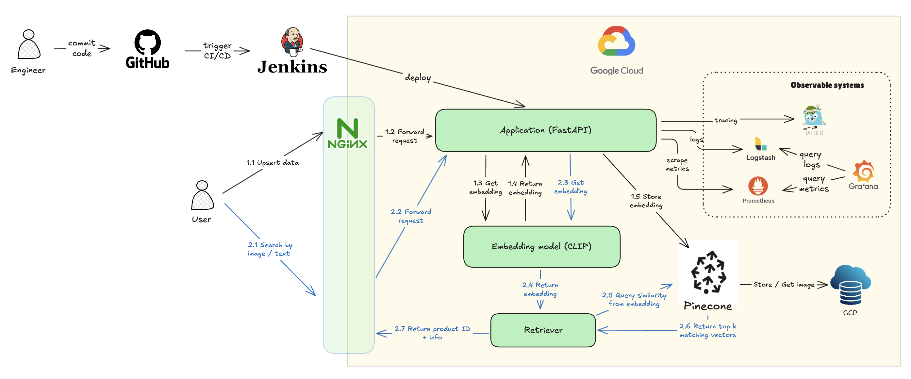
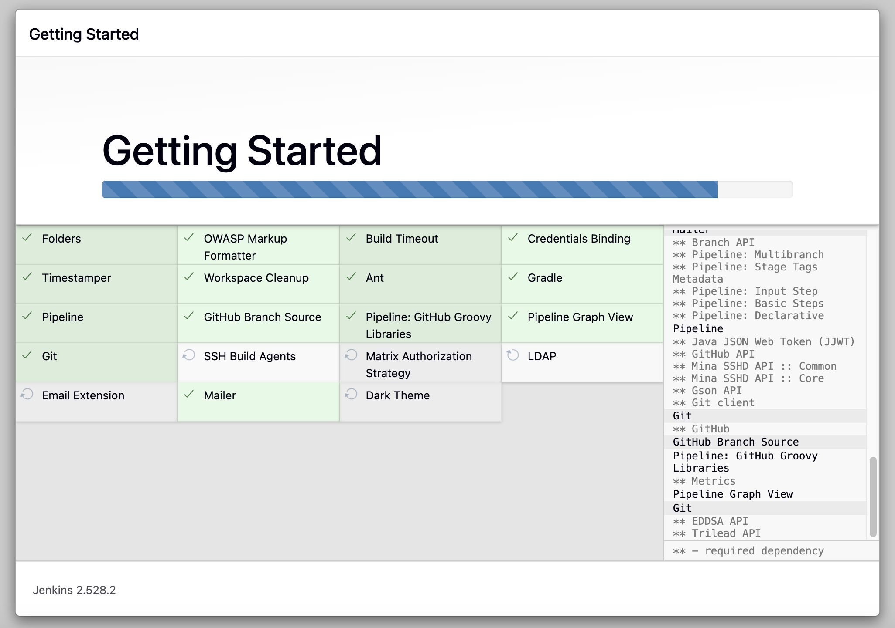
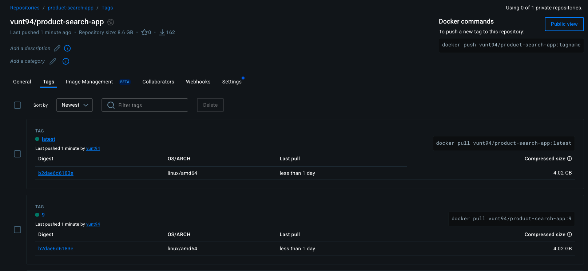

# Project: product search by image and text
## Table of content
- [1. Overview](#overview)
  - [i. Introduction](#introduction)
  - [ii. Architecture](#architecture)
- [2. Local](#deploy-locally)
  - [i. Initial setup](#initial-setup)
  - [ii. Run application & monitoring services with Docker](#run-with-docker)
- [3. Cloud](#cloud)
  - [i. Initial setup on GCP](#initial-setup-on-gcp)
  - [ii. CI/CD (Test-Build-Deploy) with Jenkins](#cicd-test-build-deploy-with-jenkins)
  - [iii. Deploy on GCP with k8s](#deploy-on-gcp-with-k8s)


## Overview
### Introduction
This **Product Search** project aims at building a scalable system that can retrieve relevant items from a catalog using either images or text queries. Using `DeepFashion Product Images` dataset, it offer three basic use cases for e-commerce product search: upserting new products, searching by image, and searching by text. The solution is deployed on Cloud (GCP) & k8s with a CI/CD pipeline, and is monitored via observability services.

**Data Source:** [DeepFashion Product Images](https://www.kaggle.com/datasets/paramaggarwal/fashion-product-images-small?select=styles.csv)

### Architecture


**Technology Stack:**
- **Build application APIs**: FastAPI
- **ML Model**: CLIP model
- **Vector Database**: Pinecone for efficient vector search
- **Source control**: Git/Github
- **CI/CD pipeline**: A fully automated `Test -> Build -> Deploy` pipeline using Jenkins with PyTest.
- **Cloud**: Google Cloud Platform (GCP)
- **Container orchestration system**: Kubernetes (K8s)
- **K8s's package manager**: Helm
- **Observable tools**: Prometheus, Grafana, Jaeger, ELK (logs, traces, metrics)

## Local deployment
### Initial setup
1. Clone the repository:
```
git clone https://github.com/thanhvu94/product-search-mlops.git product-search
cd product-search
```
2. Open Docker Desktop
### Run with Docker
Inside `product-search`, build and run the service on Docker:
```
docker compose up --build -d
```
Once everything is running, you can access all the UIs from your browser
- FastAPI App: http://localhost:8000/docs
- Grafana (Metrics): http://localhost:3000 (Login: admin / admin)
- Jaeger (Traces): http://localhost:16686
- Prometheus: http://localhost:9090
3. To run API `/upsert_product`, use the data downloaded from DeepFashion data source:
- Folder `images`: product images, named by `product id`
- File `styles.csv`: product metadata (must be converted to JSON string before upserting)

## Cloud
### Initial setup on GCP
1. Enable `Compute Engine API`
2. Choose `VM Instance` and create a new EC2 VM instance
- Machine type: `e2-standard-4` (4 vCPU, 16GB mem)
- Disk: 100GB
3. In `VPC Network > Firewall`, click `Create firewall rule` to set up allowed ports.
4. Back to `Compute Engine > VM Instances`, click Edit your VM Machine:
- On `Network tags`, add the label name of the firewall rule in step 3.
- On `SSH Keys`, click `Add item` and copy public SSH key content generated on your local machine (`cat ~/.ssh/id_rsa.pub`)
5. Remote access to EC2 VM instance `ssh -i ~/.ssh/id_rsa <VM_USERNAME>@<VM_PUBLIC_IP>
6. For new VM, install: docker-compose, minikube, kubectl
7. Clone the source code from git
```
cd ~
git clone https://github.com/thanhvu94/product-search-mlops.git product-search
cd product-search
```

### CI/CD (Test-Build-Deploy) with Jenkins
1. Inside `product-search`, build and run Jenkins on Docker:
```
docker-compose -f docker-compose.jenkins.yml up --build -d
```
2. Run this command to get the initial password for Jenkins access:
```
docker exec jenkins-server cat /var/jenkins_home/secrets/initialAdminPassword
```
3. Choose `Install suggested plugins` and wait for installation. Then, create account and set URL to complete the setup.

4. Go to `Manage Jenkins > Plugins > Available Plugins`, search and install: Docker, Docker Pipeline, SSH Agent
5. Add credentials for Jenkins in `Account > Credentials`:
  - In **System**, choose `(global)` and click on `Add Credentials`.
  - `docker-creds` (for Docker Hub):
    - Kind: username with password
    - Username: username of your Docker account
    - Password: personal access token from your Docker account settings
    - ID: docker-creds
  - `prod-ssh-key` (for server deployment)
    - Kind: SSH username with private key
    - ID: prod-ssh-key
    - Username: username of your target server
    - Private key: 
      - Generate SSH key with this command `ssh-keygen -t rsa -b 4096` (no passphrase)
      - Choose `Enter directly`, and copy content from `cat ~/.ssh/id_rsa`
6. Create the "Pipeline" job in the Jenkins UI
- Click `Create new item`, enter item name & choose `Pipeline`
- In `Pipeline` section, choose `Pipeline script from SCM`. 
  - SCM: git
  - Repository URL: https://github.com/thanhvu94/product-search-mlops.git
  - Credentials: vunguyen SSH key
  - Branches to build: */main
  - Script Path: Jenkinsfile
7. Click `Build with Parameters` and input your VM info (public IP & VM username).
- You can check `Output Console` to see the build progress
8. After stage `Build` success, you can see a new image with `latest` tag pushed here: https://hub.docker.com/r/vunt94/product-search-app/tags


### Deploy on GCP with k8s
0. Turn off running `product-search-app` container from CI/CD build
```
cd ~/product-search
docker-compose down
```
1. Start minikube:
```
minikube start --driver=docker --cpus=3 --memory=8192
```
2. Inside `product-search`, apply the k8s configuration to launch 3 pods:
```
kubectl apply -f k8s/product-search.yaml
kubectl get pods
```
3. Install helm & create a  separate namespace for monitoring
```
curl https://raw.githubusercontent.com/helm/helm/main/scripts/get-helm-3 | bash
kubectl create namespace monitoring
```
4. Add the Prometheus Community Repo
```
helm repo add prometheus-community https://prometheus-community.github.io/helm-charts
helm repo update
helm install prometheus-stack prometheus-community/kube-prometheus-stack \
  --namespace monitoring \
  --set grafana.adminPassword='admin'
```
5. Tell Prometheus to scrape metrics from product-search
```
kubectl label service product-search-service app=product-search
kubectl apply -f k8s/service-monitor.yaml
```
6. Enable port-forwarding for our services
```
kubectl port-forward svc/product-search-service 8000:80 --address 0.0.0.0 &
kubectl port-forward svc/prometheus-stack-grafana 3000:80 -n monitoring --address 0.0.0.0 &
kubectl port-forward svc/prometheus-stack-kube-prom-prometheus 9090:9090 -n monitoring --address 0.0.0.0 &
```
7. Open Prometheus & Grafana
- FastAPI App: http://<VM_EXTERNAL_IP>:8000/docs
- Grafana (Metrics): http://<VM_EXTERNAL_IP>:3000 (Login: admin / admin)
- Prometheus: http://<VM_EXTERNAL_IP>:9090
8. After finished, you can stop pods / minikube:
```
minikube stop
minikube delete
```